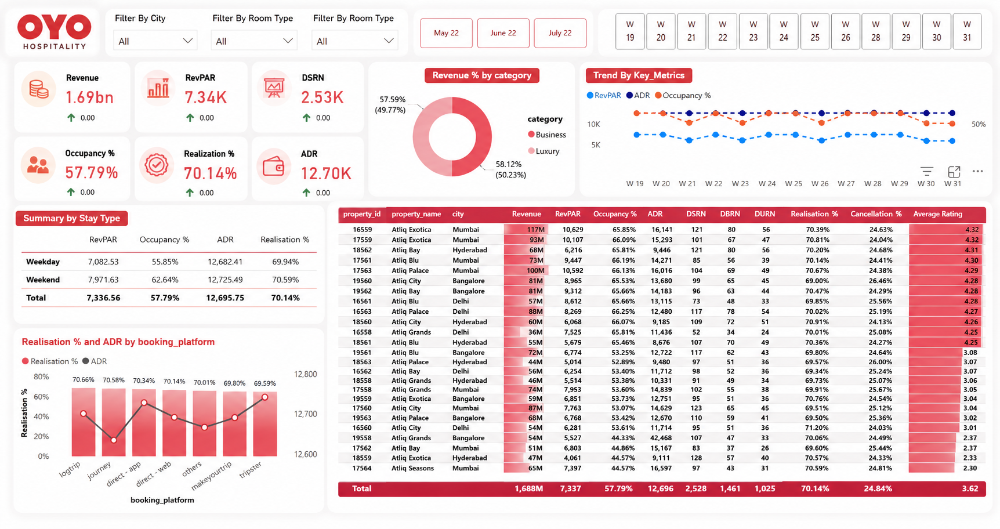
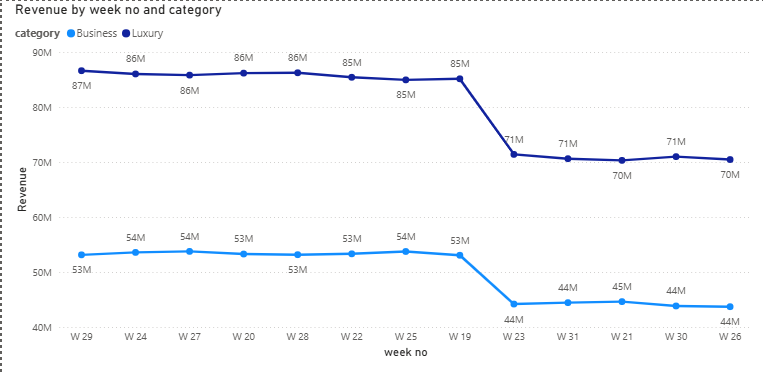

# OYO Hospitality Analysis Dashboard

## Overview
This project presents an interactive **OYO Hospitality Performance Dashboard** designed to analyze key hospitality business metrics such as revenue, occupancy, ADR, RevPAR, realization percentage, cancellation percentage, and customer ratings.

The dashboard provides a clear visual representation of hotel performance trends, booking platform efficiency, and property-wise insights to support business decision-making.

---

# Dashboard Preview

---

# Key Business Metrics

- **Revenue** – Overall generated business revenue
- **RevPAR** – Revenue Per Available Room
- **DSRN** – Daily Sellable Room Nights
- **ADR** – Average Daily Rate
- **Occupancy %** – Percentage of occupied rooms
- **Realization %** – Successful booking realization rate
- **Cancellation %** – Booking cancellation analysis
- **Average Rating** – Customer satisfaction tracking

---

# Dashboard Features

## KPI Cards
Displays major business indicators:
- Revenue
- RevPAR
- Occupancy %
- ADR
- Realization %
- DSRN

## Trend Analysis
Visualizes:
- Revenue trends
- Occupancy trends
- ADR movement
- Weekly performance comparisons

## Category Analysis
Analyzes revenue contribution across:
- Business category
- Luxury category

## Booking Platform Insights
Tracks:
- Realization %
- ADR by booking platforms

## Property-Level Analysis
Detailed table including:
- Property ID
- Property Name
- City
- Revenue
- RevPAR
- Occupancy %
- ADR
- Ratings
- Cancellation %

---

# Filters Included

The dashboard supports dynamic filtering by:
- City
- Room Type
- Month
- Week

---

# Tools & Technologies Used

| Tool | Purpose |
|------|----------|
| Power BI | Dashboard Development |
| Excel / CSV | Data Source |
| DAX | KPI Calculations |
| Power Query | Data Transformation |
| Data Modeling | Relationship Management |

---

# Business Insights Generated

- Identified high-performing properties
- Compared weekday vs weekend occupancy
- Evaluated booking platform effectiveness
- Tracked customer satisfaction ratings
- Monitored cancellation trends
- Improved hospitality revenue visibility

---

# Project Objective

The main objective of this project is to:
- Analyze hospitality business performance
- Provide actionable insights
- Improve strategic decision-making
- Monitor operational KPIs efficiently

---

# Author

**AK**  
Data Analytics Enthusiast | Power BI | SQL | Python

---

# Future Enhancements

- Predictive occupancy forecasting
- AI-based revenue prediction
- Real-time dashboard integration
- Automated reporting workflows

---

# License

This project is for educational and portfolio purposes.
